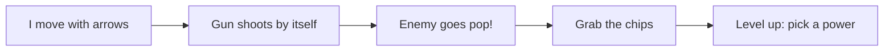

# CLAUDE.md

This file provides guidance to Claude Code (claude.ai/code) when working with code in this repository.

> 👋 This is **my control panel** for the game. I (the student) edit the three sections
> below to tell you who I am, how I want it to look, and what you must always do.
> Change the words to match what _I_ want — then ask me what to build!

---

## 1. About me

- I'm a **primary/secondary school student**. I have **little or no coding knowledge**.
- Talk to me in **simple, friendly words**. No hard computer words — and if you must
  use one, explain it like I'm new (because I am!).
- **You write the code, I make the choices.** I'll tell you what I want; you make it happen.
- Make **one small change at a time** so I can see what each change does.
- After a change, tell me in 1–2 sentences **what you changed** and **how to see it**.
- If something could break the game,
 **warn me first** and wait for my "yes".
- **Always adress me as Sir. No matter what**
- **I always know**. And I means **me** not **you**.

## 2. Design

I want the game to look **dark, minimalistic, and modern**.

- **Dark:** keep dark backgrounds and bright, glowing **red and black**,colors. Rarely go light/white.
- **Minimalistic:** clean and simple. No clutter, no busy backgrounds, lots of space.
- **Modern:** smooth, rounded, neat — like a cool phone app.
- Change the **look** by editing the color variables at the top of `style.css`
  (the `:root { ... }` block). The game reads those colors to paint everything.
- Keep text easy to read and buttons big enough to tap.

## 3. Must Do

**Every time you add or change something in the game, also make a simple picture (diagram)
so I can SEE what changed.**

- Use a **Mermaid flowchart** (boxes and arrows) saved in **`DIAGRAMS.md`**.
- If a diagram for that part already exists, **edit it** instead of making a new one.
- Use **plain kid-friendly words** in the boxes (e.g. "Enemy chases me", not function names).
- Keep it small and clear — a few boxes is better than a giant map.
- After updating the diagram, tell me to open `DIAGRAMS.md` to look at it.

Example of the picture I mean:

---

## For Claude: how this game works (so you can help fast)

**Swarm Survivor** — a top-down "survive the swarm" game (like Vampire Survivors). The hero
auto-fires at the nearest enemy; the player only moves. Kill enemies → collect XP chips →
level up → pick 1 of 3 upgrade cards. Three files, **no build step, no frameworks, no audio files.**

- `index.html` — page layout: HUD (HP, level, timer, score), XP bar, the `<canvas>`, and the
  start / level-up / game-over overlays.
- `style.css` — all styling. The `:root` color variables are the **re-skin surface**; the
  canvas reads `--hero/--arena/--grid/--xp/--shot/--ink` etc. to paint itself.
- `game.js` — everything else: tunables, content registries, the pure engine, and the
  render/audio/DOM layers.

### Run it

Open `index.html` in a web browser (double-click it, or use a Live Server / `python3 -m http.server`).
Progress (best time, mute) is saved in the browser via `localStorage`.

### The edit points (this is where most kid requests land)

Near the top of `game.js`, content lives in plain **registries** — add **one row** to add
one thing and the game loop wires it in automatically:

- `ENEMIES` — `{ id, emoji, hp, speed, behavior }`. `behavior` ∈ `chase | zigzag | splitter`
  (the engine already supports all three; the starter only ships one chaser, `glitch`).
- `WEAPONS` — `{ id, pattern, damage, cadence }`. `pattern` ∈ `straight | spread | boomerang`.
- `UPGRADES` — `{ id, name, flavor, apply(state) }`. `name`/`flavor` are the words the kid
  sees on the level-up cards; `apply` changes a stat (e.g. `s.player.damage += 5`).
- `BURSTS` — emoji that fly out on a hit/kill, keyed by content id (with a `_default` fallback).

To **rename/re-theme** content (e.g. turn the enemy into a 🐉 "Dragon"), change its `emoji`
and the `name`/`flavor` words — no engine changes needed. To **retune difficulty** (spawn rate,
speeds, damage, HP), edit the **Tunables** constants at the very top of `game.js`.

### How the engine is built (the big picture)

- **One state object** holds the whole run (`freshGame()` builds it). `update(state, dt, input)`
  advances the simulation by one frame; `render(ctx, state)` draws it; the loop in `init()`
  ties move → audio → draw → HUD together.
- **Pure core, guarded edges.** The math/engine functions (`update`, `spawnProjectiles`,
  `applyXp`, collision helpers…) are pure and don't touch the browser. Anything browser-only
  (canvas, `localStorage`, `AudioContext`) is guarded so it's safe — keep new logic this way.
- **Sound is synthesized** with tiny Web Audio blips (`SFX` in `game.js`). **Never add audio
  files.** To change a sound, change its oscillator notes.
- `update()` sets one-shot flags (`_fired`, `_kill`, `_hurt`…) that the audio layer reads and
  clears each frame — that's how a kill makes a sound without the engine knowing about audio.
- `game.js` ends with a `module.exports` guard so the pure functions can be unit-tested with
  `node --test` (no tests ship yet; the hook is there if you add some).

### When you make a change

1. Prefer the **smallest** edit — usually one registry row, one tunable, or one CSS variable.
2. Keep the **dark / minimal / modern** design above.
3. **Update `DIAGRAMS.md`** per the Must Do section.
4. Tell the student in plain words what changed and how to see it.

## 4. My world: Viking
Apply to everything you make from now on:
-Every new enemy is a defender( knight or medival soldier)
-Character is a viking always.
-Weapons are based off weapons vikings used.(throwing axe, battering ram, etc)
-Background is a coastal village, maybe with a castle, from viking times
- instead of xp chips enemies drop gold

## Voice
All game text is viking slang by default:
- upgrade card names: Viking slang/language. Appropriate for vikings, eg: Sharper axes for more damage card
- enemy names: names vikings used for knights or peasants. 

## Feel
Keep it chaotic and fast, make it feel as if the enemies are desperate.
- Every wave should feel fun and as if the enemies are deperate.
- never too hard except at boss levels.

## Sound
All sound is loud and viking like
- enemies make a appropriate groan when they die
- background music is traditional viking music
- on level up viking laugh plays

