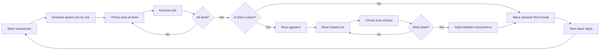
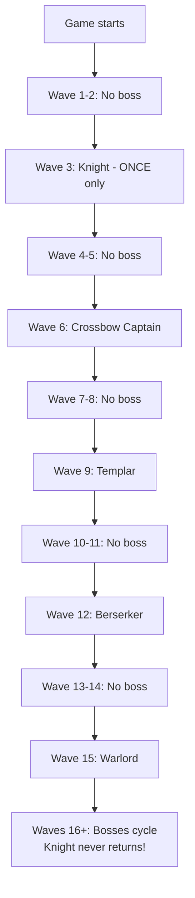
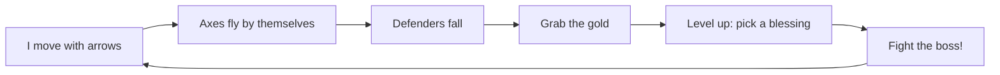
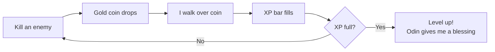

# Game Diagrams — Viking Swarm

## The Battlefield

The game now has a **coastal medieval village** background drawn on the canvas:
- Dusk sky with distant snow-capped mountains
- A stone castle on the hill to the right
- Village longhouses with warm glowing windows
- Pine trees along the shoreline
- A viking longship in the water
- Subtle grid overlay for gameplay clarity

All characters are **drawn as proper shapes** — no emojis.

## Wave System

## Enemies (Drawn Shapes)

| Type | Appearance | Health | Speed | Behavior |
|------|-----------|--------|-------|----------|
| Peasant | Brown tunic, pitchfork | 15 HP | 70 | Chase |
| Footman | Gray armor, sword, shield | 25 HP | 55 | Chase |
| Skirmisher | Green hood, bow | 18 HP | 50 | Zigzag |
| Knight (Boss) | Plate armor, greatsword, gold-rim shield | 40 HP | 50 | Chase |
| Crossbow Captain (Boss) | Leather, crossbow | 55 HP | 45 | Zigzag |
| Templar (Boss) | Heavy plate, greatsword, red cape | 70 HP | 55 | Chase |
| Berserker (Boss) | Bare chest, bear pelt, dual axes | 50 HP | 75 | Chase |
| Warlord (Boss) | Dark plate, crown, flaming sword | 100 HP | 40 | Chase |

## Boss Roster

## Boss Stats

| Boss | Wave | Health | Damage | Defence | Speed |
|------|------|--------|--------|---------|-------|
| Knight | 3 (ONCE) | 40 HP | 32 (4x) | 20% | 50 |
| Crossbow Captain | 6+ | 55 HP | 26 | 10% | 45 |
| Templar | 9+ | 70 HP | 30 | 25% | 55 |
| Berserker | 12+ | 50 HP | 40 (5x!) | 5% | 75 |
| Warlord | 15+ | 100 HP | 45 | 35% | 40 |

## Main Game Loop

## Gold & XP

